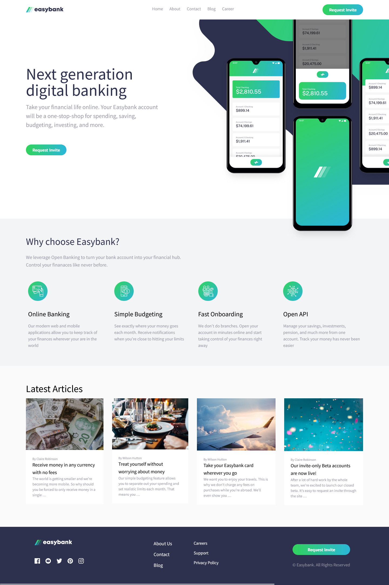

# Frontend Mentor - Easybank landing page solution

This is a solution to the [Easybank landing page challenge on Frontend Mentor](https://www.frontendmentor.io/challenges/easybank-landing-page-WaUhkoDN). Frontend Mentor challenges help you improve your coding skills by building realistic projects. 

## Table of contents

- [Overview](#overview)
  - [The challenge](#the-challenge)
  - [Screenshot](#screenshot)
  - [Links](#links)
- [My process](#my-process)
  - [Built with](#built-with)
  - [What I learned](#what-i-learned)
  - [Useful resources](#useful-resources)
- [Author](#author)

**Note: Delete this note and update the table of contents based on what sections you keep.**

## Overview

### The challenge

Users should be able to:

- View the optimal layout for the site depending on their device's screen size
- See hover states for all interactive elements on the page

### Screenshot



### Links

- Live Site URL: [Live Site](https://landing-page-project-eight.vercel.app/)
## My process

### Built with

- Semantic HTML5 markup
- Flexbox
- Mobile-first workflow
- [React](https://reactjs.org/)
- [TailwindCSS](https://tailwindcss.com/)

**Note: These are just examples. Delete this note and replace the list above with your own choices**

### What I learned

This project was the first time I used a CSS Framework instead of writing plain CSS. It was definitely a bit challenging to set up everything with the custom properties I wanted to use. Though, it was worth it as it made developing this landing page fast and easy as I didn't have to think about the class names for my elements and switch between the css and jsx file.

To see how you can add code snippets, see below:

```html
<div className='relative md:max-h-[32rem] xl:max-h-[42rem]'>
          </img>
          </img>
          </img>
</div>
```

### Useful resources

- [Tailwind Docs](https://tailwindcss.com/docs) - The documentation has immensely helped me to learn TailwindCSS and its syntax.

## Author

- Website - [Bakhtiar Reza](https://bakhtiar-reza-site.vercel.app/)
- Frontend Mentor - [@Dradeon](https://www.frontendmentor.io/profile/Dradeon)


